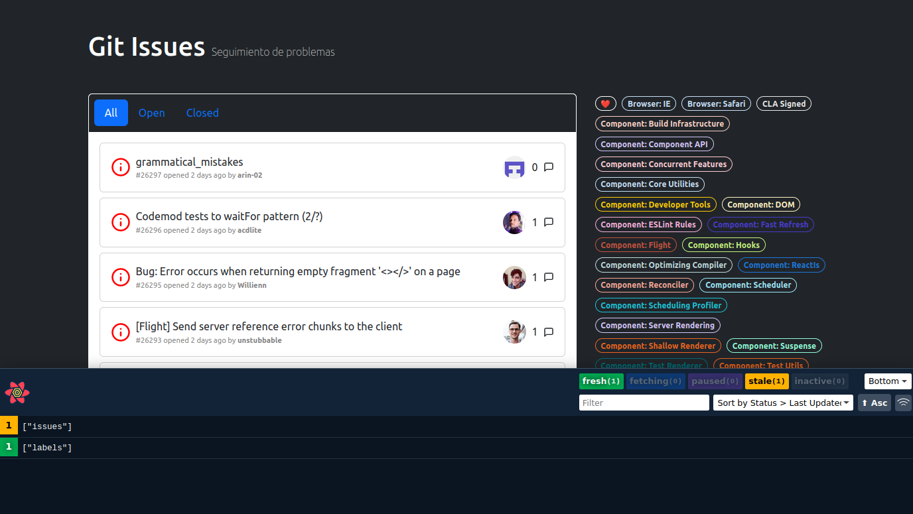

# React Query Examples


## Installation

Get code using

```
git clone https://github.com/baguilar6174/next-openjira-app.git
```

Step 2:

Install the necessary libraries (make sure you have node >= 16 and yarn)

```
yarn
```

Step 3:

Runs the app in the development mode

```
yarn dev
```

## My process

### Build with

- React 18
- Typescript
- Bootstrap
- React Query
- Github Issues API

### What I learned

- Configuración de React Query
- DevTools
- Caché
  - Fresh
  - Stale
  - Inactive
  - Fetching
- Propiedades como:
  - stale time
  - placeholderData
  - initialDate

## Github Issues App

<table>
  <tr>
    <td align="center" valign="center"></td>
  </tr>
</table>

## Stay in touch

- Website - [www.bryan-aguilar.com](https://www.bryan-aguilar.com/)
- Medium - [baguilar6174](https://baguilar6174.medium.com/)
- LinkeIn - [baguilar6174](https://www.linkedin.com/in/baguilar6174)